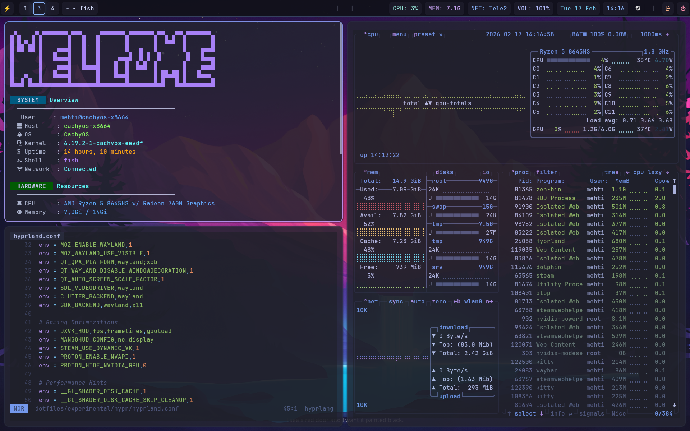

# Hyprland Dotfiles — Wayland Tiling Window Manager Config

[](https://github.com/hyprwm/Hyprland)
[](LICENSE)
[](https://cachyos.org)

A minimal, clean **Hyprland configuration** for daily productivity on **Arch Linux** and **CachyOS**. Features **Tokyo Night Dark theme**, minimal animations for snappy responsiveness, **VRR support**, and pre-configured **window rules** for 50+ popular applications.



> [!CAUTION]
> Use on a fresh [CachyOS](https://cachyos.org/) installation with the Hyprland edition for best results.

---

## 🚀 Quick Start

### 1. Install

```bash
git clone https://github.com/mehdi-hossaini/dotfiles.git
cd dotfiles
chmod +x setup.sh
./setup.sh
```

### 2. Auto-detect Monitor

```bash
sed -i 's/^monitor = .*/monitor = , preferred, auto, auto/' ~/.config/hypr/hyprland.conf
```

### 3. Set Keyboard Layout

Replace `us` with your layout:

```bash
sed -i 's/kb_layout = se/kb_layout = us/' ~/.config/hypr/hyprland.conf
```

Common layouts: `us` `gb` `de` `fr` `es`

> [!TIP]
> Log out and back in to apply all changes. Done!

---

## ⚙️ Features

| Feature | Description |
|---------|-------------|
| **Theme** | Tokyo Night Dark with GTK/Qt consistency |
| **Performance** | Animations disabled, VRR/VFR enabled |
| **Layout** | Dwindle tiling, 6px inner / 12px outer gaps |
| **Workspaces** | Auto-assigned apps per workspace |
| **Window Rules** | 50+ pre-configured applications |
| **Components** | Waybar, Wofi, Dunst, Kitty, Dolphin, Pipewire |

### Workspace Assignments

| Workspace | Apps |
|-----------|------|
| 1 | Browser (Firefox, Zen, Chrome) |
| 2 | Files (Dolphin, Nautilus) |
| 3 | Code (VSCode, JetBrains) |
| 4 | Social (Discord, Telegram) |
| 5-6 | Media (Spotify, VLC) |
| 7 | Creative (GIMP, Blender) |
| 8 | Office (LibreOffice) |
| 9 | VMs (Virt-Manager) |

---

## ⌨️ Keybinds

### Window Management

| Key | Action |
|-----|--------|
| `SUPER + Enter` | Open terminal (Kitty) |
| `SUPER + E` | Open Zen Browser |
| `SUPER + F` | Open file manager (Dolphin) |
| `SUPER + Q` | Close window |
| `SUPER + V` | Toggle fullscreen |
| `SUPER + D` | Toggle Wofi app launcher |
| `SUPER + Shift + E` | Exit Hyprland |

### Navigation

| Key | Action |
|-----|--------|
| `SUPER + ←/→/↑/↓` | Focus window |
| `SUPER + Shift + ←/→/↑/↓` | Move window |
| `SUPER + 1-9,0` | Switch workspace |
| `Alt + Tab` | Next in group |

### Quick Launch

| Key | App |
|-----|-----|
| `SUPER + Shift + S` | Steam |
| `SUPER + Shift + D` | Discord |
| `SUPER + Shift + M` | Spotify |
| `SUPER + Shift + C` | VSCode |
| `SUPER + Shift + T` | Dropdown terminal |

### Screenshots

| Key | Action |
|-----|--------|
| `Print` | Full screen → file |
| `SUPER + Print` | Area selection → file |
| `Shift + Print` | Area selection → clipboard |

### Media Keys

| Key | Action |
|-----|--------|
| `Volume Up/Down` | ±3% |
| `Brightness Up/Down` | ±5% |
| `Play/Pause/Next/Prev` | Media controls |

---

## 📋 Supported Applications

<details>
<summary>View all applications with pre-configured window rules</summary>

> [!NOTE]
> These applications are **not included**. Only window rules are pre-configured. Install what you need.

- **Browsers:** Firefox, Zen Browser, Chrome, Chromium, Brave, Librewolf
- **Terminals:** Kitty, Alacritty, Foot, Wezterm
- **File Managers:** Dolphin, Nautilus, Thunar, PCManFM, Nemo
- **IDEs:** VSCode, VSCodium, JetBrains IDEs, Zed, Neovide, Emacs
- **Communication:** Discord, Slack, Teams, Telegram, Signal, WhatsApp
- **Media:** Spotify, VLC, MPV, OBS, Audacity
- **Gaming:** Steam, Lutris, Heroic, Bottles, Minecraft
- **Creative:** GIMP, Inkscape, Krita, Blender
- **Office:** LibreOffice, OnlyOffice
- **VMs:** Virt-Manager, VirtualBox, Remmina

</details>

---

## 🏷️ Topics

`hyprland` `dotfiles` `wayland` `arch-linux` `cachyos` `tokyo-night` `ricing` `tiling-window-manager` `waybar` `wofi` `kitty` `linux` `desktop-setup` `hyprland-config` `hyprland-theme`
